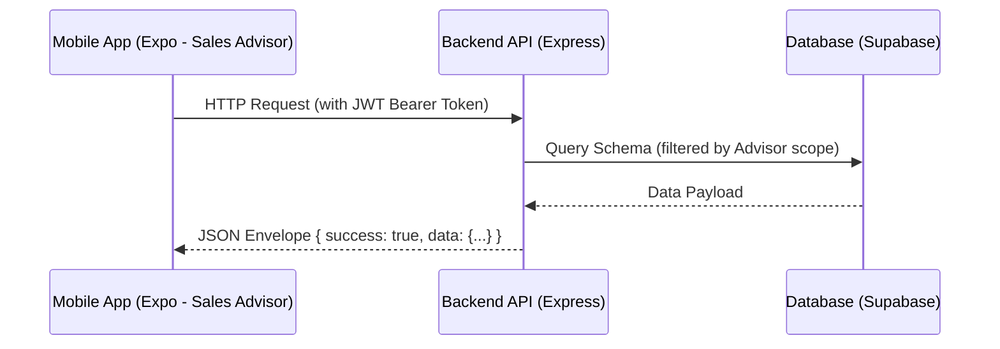

# Bopacorp CRM — Mobile Sales Advisor Integration System Design

This document describes the connection architecture, network protocol, authentication mechanism, and data validation pipeline that integrate the **Bopacorp Mobile** application (Expo/React Native) with the **Bopacorp API** backend (Express/Node.js).

This mobile client is designed **exclusively for the Sales Advisor (Asesor) role**; it contains no administrator, coordinator, or supervisor components.

---

## 1. System Topology & Communication Flow



The mobile client functions as a consumer of the backend REST API. All communication takes place over HTTPS using structured JSON envelopes:

*   **Request Headers**: All authenticated endpoints require the standard header:
    ```http
    Authorization: Bearer <Access_Token>
    ```
*   **Response Envelope**: The backend wraps all data in a standard success/error signature:
    ```json
    // Success Response
    {
      "success": true,
      "data": { ... }
    }

    // Error Response
    {
      "success": false,
      "error": {
        "code": "ERROR_CODE",
        "message": "Human-readable explanation"
      }
    }
    ```

---

## 2. Authentication & Session Security (Token Pair System)

To secure mobile sessions for field advisors and prevent unauthorized token extraction, the application uses a dual-token strategy:

### 2.1 Storage Architecture
1.  **Access Token (Short-Lived, JWT)**:
    *   **Lifetime**: 1d
    *   **Storage**: Kept strictly in-memory (React context / state) to prevent access from device root exploits.
2.  **Refresh Token (Long-Lived, Opaque String)**:
    *   **Lifetime**: 30d
    *   **Storage**: Stored in the device's native encrypted hardware keychain using `expo-secure-store`.

### 2.2 Silent Refresh Flow
When an access token expires during advisor operations:
1.  The mobile client receives an HTTP `401 Unauthorized` response.
2.  An API interceptor pauses all outgoing requests.
3.  The client reads the refresh token from `expo-secure-store` and sends a request to `/api/v1/auth/refresh`.
4.  Upon success, the new token pair is stored, headers are updated, and the paused requests are retried.
5.  If rotation fails (e.g. token expired/revoked), the session is terminated, and the advisor is redirected to the login screen.

---

## 3. Data Validation & Shared Schema Architecture

To prevent schema discrepancies between client and server, both systems utilize a single source of truth:

*   **Shared Contract Library**: Both `bopacorp-api` and `bopacorp-mobile` consume the workspace package `@bopacorp/shared`.
*   **Form & API Validation**: Mobile forms (e.g., client registration) are validated locally using the same Zod schemas (e.g. `CreateBusinessClientRequestSchema`) that the backend uses to validate incoming requests.
*   **Error Mapping**: If the API returns a validation error, the response interceptor maps it to native UI fields based on Zod error paths.

---

## 4. API Endpoint Map for Sales Advisor Client

The mobile app connects to the following routes:

### 4.1 Public Endpoints
*   `POST /api/v1/auth/login` — Authenticates advisor credentials and returns a token pair.
*   `POST /api/v1/auth/refresh` — Rotates expired access tokens using the refresh token.
*   `POST /api/v1/employability/apply` — Accepts candidate form data along with PDF resume uploads for external recruitment.

### 4.2 Authenticated Endpoints (Filtered by Advisor Owner)
*   `GET /api/v1/crm/business-clients` — Lists corporate clients assigned to the logged-in advisor.
*   `POST /api/v1/crm/business-clients` — Creates a new corporate client profile assigned to the advisor.
*   `GET /api/v1/crm/negotiations` — Lists advisor's negotiations/deals.
*   `POST /api/v1/crm/negotiations` — Launches a new negotiation pipeline.
*   `GET /api/v1/crm/visits` — Lists logged advisor visits.
*   `POST /api/v1/crm/visits` — Logs a client visit.
*   `GET /api/v1/catalog` — Fetches active product and service catalogs.

---

## 5. Offline Resiliency & Caching

Since sales advisors operate in the field where network coverage is volatile:
*   **TanStack Query (React Query)** handles client-side caching of catalogs, clients, and deal lists.
*   The client caches recent network responses, allowing the app to remain readable offline and sync updates once connection is restored.
